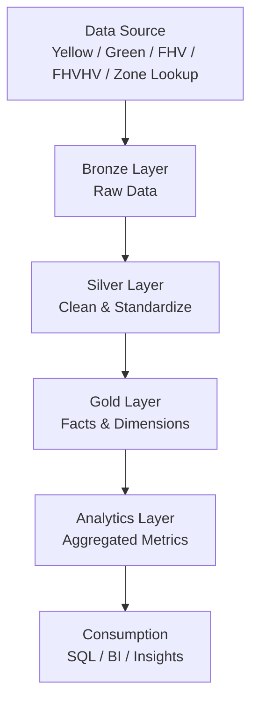
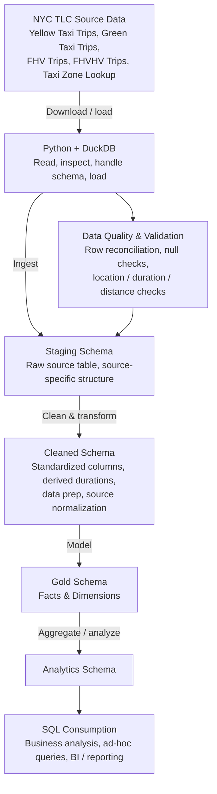
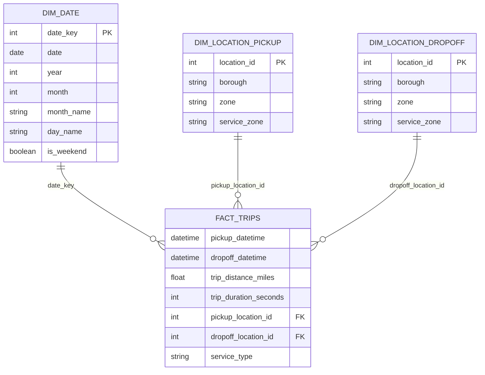
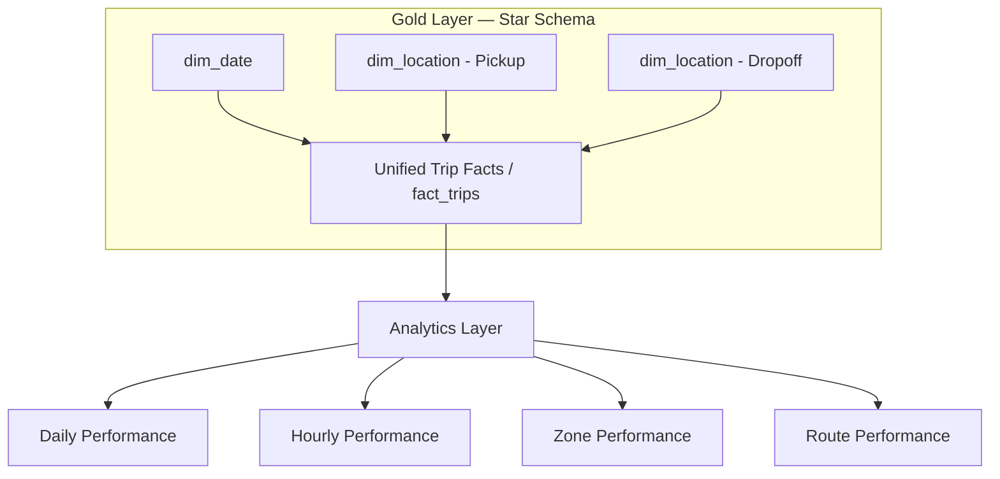

# NYC TLC Data Pipeline

An end-to-end data pipeline that integrates four disparate NYC Taxi & Limousine Commission (TLC) trip datasets — Yellow Taxi, Green Taxi, FHV, and FHVHV — plus the Taxi Zone Lookup table, into a unified analytics-ready warehouse.

Raw Parquet files are ingested with Python and DuckDB, validated, staged, cleaned, and modeled into a dimensional (star schema) gold layer, which powers a set of independent performance reports consumed via SQL/BI.

> **Note:** All diagrams below are written in [Mermaid](https://mermaid.js.org/), which GitHub renders natively — no external image files needed. If a diagram doesn't render, view this file directly on GitHub rather than in a plain text editor.

---

## 1. Architecture at a Glance

The pipeline follows a **medallion architecture**: raw source data moves through progressively refined layers until it's ready for consumption.



---

## 2. Detailed Data Flow

Zooming into the bronze → silver transition: ingested data passes through a dedicated **data quality & validation** step before it's accepted into staging.



---

## 3. Gold Layer: Dimensional Data Model

The gold layer is a star schema. `dim_location` is a **role-playing dimension** — the same physical table is joined twice into the fact table, once for the pickup location and once for the dropoff location.



---

## 4. Gold-to-Analytics Lineage

This is the full lineage from raw dimensions through to reporting. The four performance reports are **independent of one another** — each is derived directly from the analytics layer, not from combining the others.



---

## 5. Tech Stack

| Layer | Tooling |
|---|---|
| Ingestion | Python, DuckDB |
| Validation | Python (row reconciliation, null / location / duration / distance checks) |
| Warehouse | PostgreSQL |
| Modeling | Dimensional (star schema) — facts & dimensions |
| Consumption | SQL, BI tooling |

---

## 6. Repository Structure

```
.
├── ingestion/          # Python + DuckDB source-reading and loading scripts
├── validation/         # Data quality checks
├── sql/
│   ├── staging/        # Staging schema DDL
│   ├── cleaned/        # Cleaned schema transformations
│   ├── gold/           # Fact and dimension table DDL + models
│   └── analytics/      # Aggregated reporting views
└── README.md
```

---

## About This Project

This project was built to practice integrating multiple heterogeneous NYC TLC trip datasets into a single coherent warehouse, following medallion architecture and dimensional modeling best practices — from raw Parquet ingestion through to a query-ready analytics layer.
