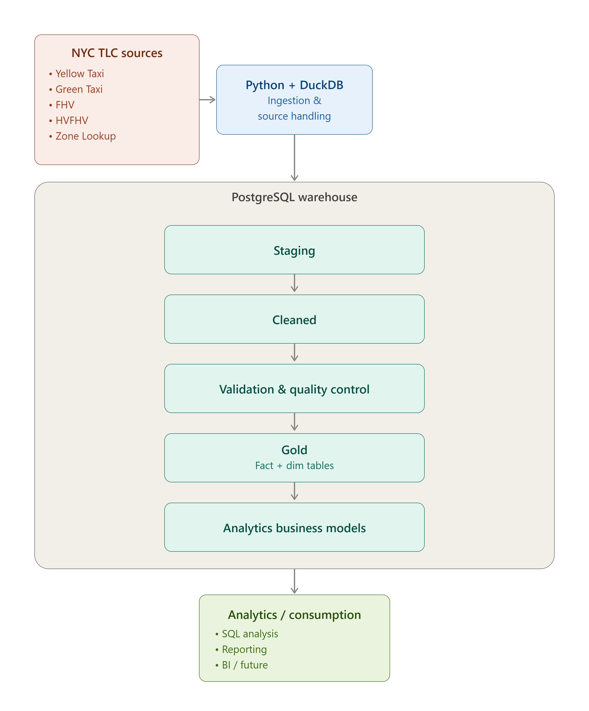
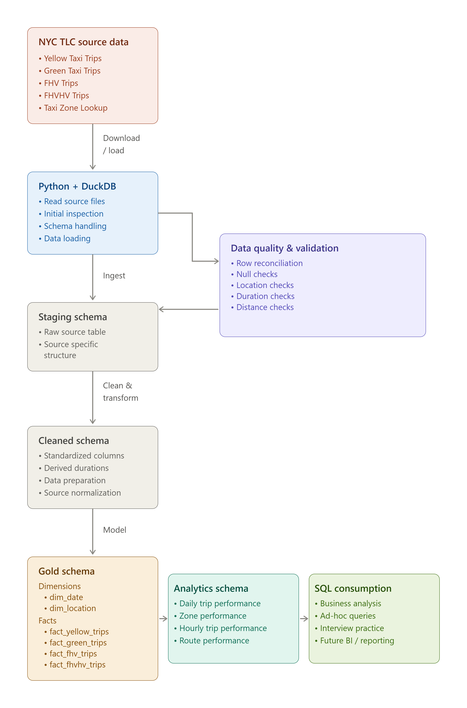

# 🏗️ Architecture & Data Flow

The pipeline follows a layered data architecture that progressively transforms raw NYC TLC trip data into analytics-ready datasets.

The four transportation services have different source schemas and levels of data availability. Instead of analyzing each dataset independently, the pipeline standardizes them into a common trip structure while preserving service-specific differences where necessary.

## Data Architecture

The architecture follows a layered approach:

**Source Data → Bronze → Silver → Gold → Analytics → Consumption**

The purpose of each layer is described below.

### 🥉 Bronze Layer — Raw Data

The Bronze layer contains the original source datasets after ingestion.

The raw NYC TLC data is loaded from Parquet files using **Python and DuckDB**. At this stage, the datasets retain their source-specific structures and are not yet integrated.

The Bronze layer contains:

* Yellow Taxi trip data
* Green Taxi trip data
* FHV trip data
* FHVHV trip data
* NYC Taxi Zone Lookup data

Keeping the raw datasets separate allows the original source structure to be preserved before transformation.

---

### 🥈 Silver Layer — Standardization & Cleaning

The Silver layer prepares the source datasets for integration.

Because the four trip datasets do not share identical schemas, service-specific transformation logic is applied to standardize the available information into a common structure.

Key transformations include:

* Standardizing column names across services
* Standardizing pickup and dropoff timestamps
* Deriving trip duration
* Standardizing trip distance fields where available
* Adding service type identifiers
* Preparing location fields for enrichment
* Handling source-specific missing or unavailable fields

The result is a consistent trip structure that can be integrated across the different NYC TLC services.

---

### 🥇 Gold Layer — Dimensional Model

The Gold layer contains the core analytical data model.

The standardized trip data is modeled into a dimensional structure consisting of:

* `fact_trips`
* `dim_date`
* `dim_location`

The fact table stores the trip-level activity, while the dimension tables provide descriptive context for time and geographic locations.

The `dim_location` table is used as a **role-playing dimension**, allowing the same location dimension to describe both pickup and dropoff locations.

This layer provides the central, reusable model used by downstream analytics.

---

### 📊 Analytics Layer

The Analytics layer contains aggregated datasets built directly from the Gold dimensional model.

These datasets support different levels of analysis without modifying the underlying fact table.

The current analytics models include:

* **Daily Trip Performance** — Trip activity and performance by date
* **Hourly Trip Performance** — Trip activity and performance by hour of day
* **Zone Performance** — Pickup zone-level performance
* **Route Performance** — Pickup-to-dropoff route analysis

Each analytics dataset is designed for a specific analytical purpose and can be queried independently.

---

# 🔄 Detailed Data Flow

The following diagram shows how data moves through the pipeline from ingestion to analytical consumption.

## 1. Source Ingestion

The pipeline begins with the NYC TLC source datasets stored as Parquet files.

Python and DuckDB are used to read and inspect the source files before loading them into the data warehouse.

At this stage, the datasets are treated independently because their schemas and available fields differ.

---

## 2. Data Validation

Before the data is used for downstream transformations, validation checks are performed to identify structural and data quality issues.

Validation includes checks such as:

* Row count reconciliation
* Date coverage
* Service type coverage
* Missing pickup and dropoff locations
* Unmapped location IDs
* Missing distance values
* Zero or negative trip durations
* Extreme duration values
* Extreme distance values

The validation process helps identify source-data limitations and anomalies before the data is used in analytical models.

---

## 3. Schema Standardization

Each transportation service is transformed into a common trip structure.

The standardized structure allows the datasets to be integrated while accounting for service-specific limitations.

For example, FHV data does not provide trip distance information, so distance-based metrics remain unavailable for that service rather than being artificially calculated or inferred.

---

## 4. Location Enrichment

The NYC Taxi Zone Lookup table is used to enrich trip records with geographic information.

Pickup and dropoff location IDs are linked to descriptive attributes including:

* Borough
* Zone
* Service Zone

This enrichment provides the geographic context required for zone and route-level analysis.

---

## 5. Dimensional Modeling

The standardized and enriched trip data is loaded into the Gold dimensional model.

The model provides a reusable foundation for analytical queries by separating:

* **Facts** — Trip-level activity and metrics
* **Dimensions** — Time and location context

This structure supports multiple analytical models without duplicating the core transformation logic.

---

## 6. Analytical Consumption

The final Analytics layer aggregates the Gold model into purpose-specific datasets.

These datasets can be used for:

* SQL analysis
* Ad-hoc business questions
* Reporting
* Dashboard development
* Business intelligence tools

The analytics models are built independently from the Gold layer, allowing each analysis to focus on a specific business question while maintaining a consistent underlying data model.
