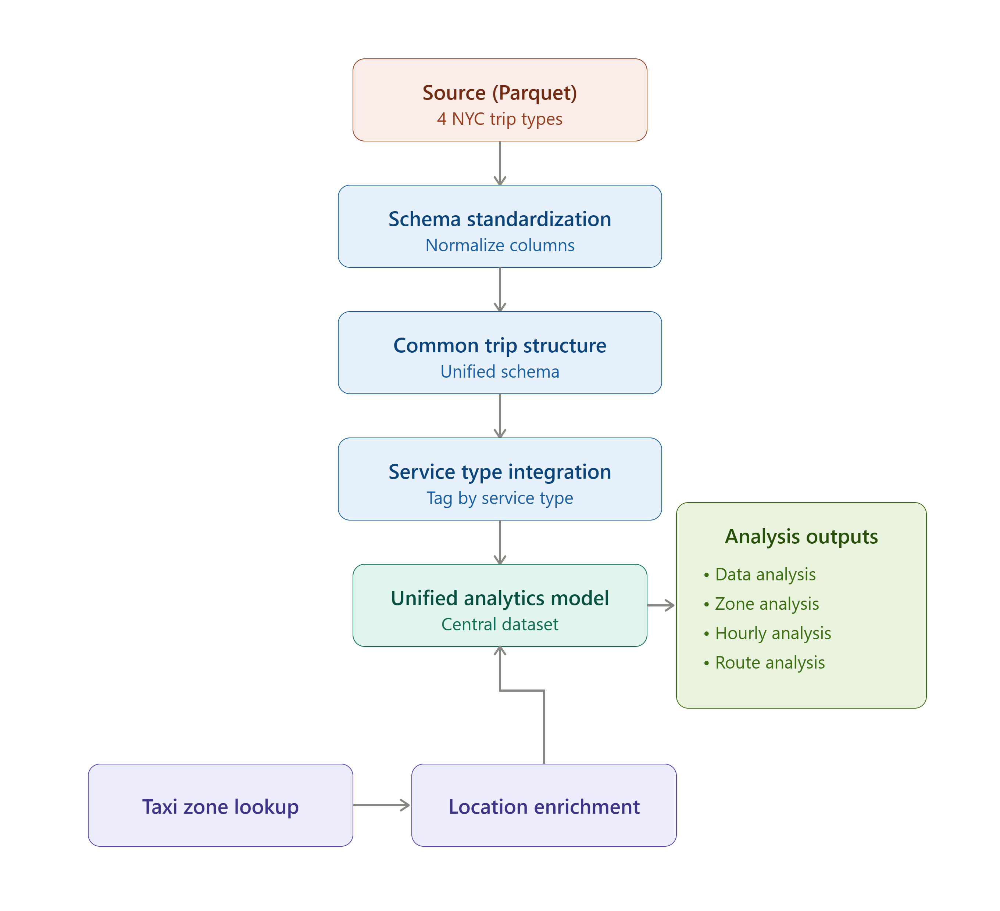

## Data Integration

The four TLC trip datasets describe different transportation services and are not structurally identical. The integration process standardizes their common concepts while preserving service-specific characteristics and source limitations.

### Integration Flow

The four TLC trip datasets describe different transportation services and are not structurally identical. The integration process standardizes their common concepts while preserving service-specific characteristics and source limitations.

### Schema Standardization

Each source dataset is first processed according to its own schema and data characteristics. Common concepts such as pickup time, drop-off time, pickup location, drop-off location, trip duration, and service type are standardized where the source provides the required information.

Source-specific attributes are not artificially populated when equivalent information is unavailable. For example, FHV does not provide trip distance in the same way as the taxi datasets, so distance metrics remain unavailable for FHV rather than being estimated or fabricated.

### Common Trip Structure

After standardization, the datasets share a common analytical structure around the core concepts of a trip:

* Pickup and drop-off timestamps
* Pickup and drop-off locations where available
* Trip duration
* Trip distance where available
* Service type
* Source-specific financial and operational attributes where applicable

This provides a consistent foundation for cross-service analysis while retaining important differences between the underlying services.

### Service Type Integration

The service-specific datasets remain separate at the Gold fact-table level:

* `fact_yellow_trips`
* `fact_green_trips`
* `fact_fhv_trips`
* `fact_fhvhv_trips`

A `service_type` attribute allows the Analytics layer to combine these sources when comparing transportation services without losing the distinction between them.

### Location Enrichment

The Taxi Zone Lookup dataset provides the reference data required to translate TLC location IDs into meaningful geographic attributes such as:

* Borough
* Zone
* Service zone

The same `dim_location` table is used for both pickup and drop-off locations. This is a role-playing dimension: the physical dimension is stored once, while trip records reference it in different roles depending on whether the location represents a pickup or a drop-off.

### Result

The result is not a single physically merged trip table. Instead, the pipeline produces a **consistent analytical model** in which heterogeneous source datasets can be analyzed together while preserving their individual characteristics and known limitations.

This approach allows the Analytics layer to support common questions across **date, location, hour, and route**, without hiding important differences in the underlying source data.
