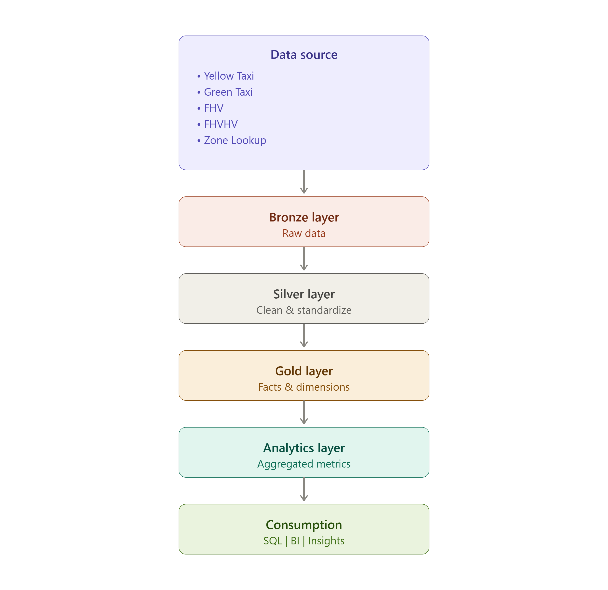

## 🧩 Data Model

The Gold layer uses a **dimensional data model** designed to provide a consistent analytical foundation for the different NYC TLC transportation services.

The source datasets differ in structure and available attributes, so the model standardizes common analytical concepts while preserving service-specific characteristics.

### Star Schema Design

The Gold layer separates descriptive attributes from trip-level activity using a dimensional modeling approach.

The model consists primarily of:

* **Date Dimension** — provides calendar context for analysis
* **Location Dimension** — provides geographic context for pickup and dropoff locations
* **Trip Fact Tables** — contain service-specific trip activity and measures

This structure makes the data easier to query and provides a reusable foundation for downstream analytics.

---

### 📅 Date Dimension

The `gold.dim_date` table provides calendar attributes used across the analytical models.

Key attributes include:

* Date
* Year
* Month
* Month name
* Day name
* Weekend indicator

The date dimension supports time-based analysis without repeatedly deriving calendar attributes from trip timestamps.

It is used by downstream models for analyses such as:

* Daily trip performance
* Monthly comparisons
* Weekday versus weekend patterns

---

### 📍 Location Dimension

The `gold.dim_location` table contains the geographic information associated with NYC TLC Taxi Zone IDs.

Each location includes descriptive attributes such as:

* Location ID
* Borough
* Zone
* Service zone

The location dimension enriches the numerical location IDs contained in the trip datasets and makes geographic analysis easier to understand.

### Role-Playing Location Dimension

The same location dimension is used in two different roles:

* **Pickup location**
* **Dropoff location**

Rather than maintaining separate copies of the location data, trip records reference the same dimension depending on the role of the location.

This supports analyses such as:

* Pickup zone performance
* Dropoff zone analysis
* Most common pickup-to-dropoff routes
* Borough-level trip patterns

---

### 🚕 Service-Level Trip Facts

The four NYC TLC transportation services are modeled separately to preserve their source-specific characteristics:

* Yellow Taxi
* Green Taxi
* FHV
* FHVHV

Although the datasets follow a standardized analytical structure, they do not all contain the same information.

For example, trip distance is available for Yellow, Green, and FHVHV trips but is not available in the FHV dataset.

Rather than artificially creating missing information, the model preserves these differences. Metrics are only populated when the corresponding information exists in the original source data.

This allows the pipeline to support cross-service analysis without hiding important limitations in the underlying datasets.

---

### 🔗 Relationship Between Facts and Dimensions

The trip fact data connects to the shared dimensions through common analytical keys.

The primary relationships include:

* Trip date → `dim_date`
* Pickup location → `dim_location`
* Dropoff location → `dim_location`

The dimensions provide descriptive context, while the fact tables contain the measurable trip activity.

This separation allows the same dimensions to be reused across multiple analytical models.

---

### 📊 From Gold to Analytics

The Gold model acts as the central foundation for the Analytics layer.

Instead of repeatedly transforming raw trip data for every report, the analytics models build on the standardized Gold datasets.

The current analytics models include:

* **Daily Trip Performance**
* **Hourly Trip Performance**
* **Zone Performance**
* **Route Performance**

Each model answers a different analytical question while relying on the same underlying dimensional structure.

### Why This Model?

The dimensional design provides several advantages:

* Consistent analytical definitions across services
* Reusable date and location dimensions
* Clear separation between descriptive attributes and trip activity
* Support for cross-service analysis
* Preservation of source-specific limitations
* A structured foundation for SQL analysis and future BI reporting

The result is a scalable analytical model that transforms four heterogeneous NYC TLC datasets into a consistent structure suitable for querying, reporting, and further analysis.
